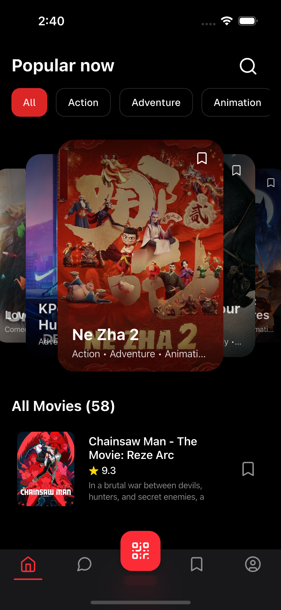
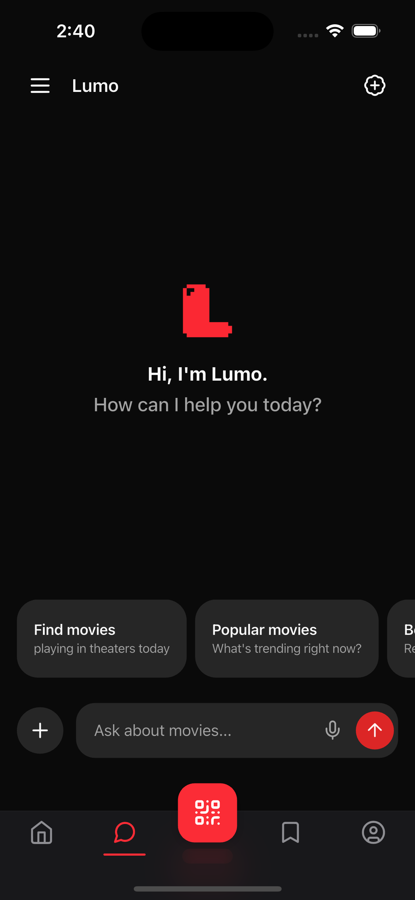

# Lumo App

A modern Flutter application for movies and AI-powered chat, featuring a clean architecture, streaming chat capabilities, and a beautiful iOS-native design using shadcn_ui and Cupertino components.

## Screenshots

<div align="center">
  
  
</div>

## Features

### 🎬 Movies
- Browse and discover movies with TMDB integration
- Search functionality
- Detailed movie information
- Favorites management

### 💬 AI Chat
- Real-time streaming chat powered by AI
- Session management (create, rename, archive, delete)
- Server-Sent Events (SSE) for live responses
- Chat history and session organization

### 👤 User Profile
- User authentication (login/register)
- JWT token management
- Profile viewing and management

### 🎨 Design
- iOS-native feel with Cupertino design system
- shadcn_ui components integration
- Red theme color scheme
- Dark mode support
- Localization: English (en-US) and Khmer (km-KH)

## Tech Stack

- **Framework**: Flutter 3.x with Dart 3.8.1+
- **State Management**: BLoC/Cubit pattern with flutter_bloc
- **Navigation**: go_router with StatefulShellRoute
- **UI**: shadcn_ui + CupertinoApp
- **Networking**: Dio + Retrofit
- **Code Generation**: build_runner, freezed, json_serializable
- **Icons**: Lucide icons

## Architecture

This project follows **Clean Architecture** principles with feature-based organization:

```
lib/
├── core/                     # Shared infrastructure
│   ├── data/                 # Core data components
│   ├── domain/               # Core business logic
│   ├── presentation/         # Shared UI components
│   ├── navigation/           # App routing
│   ├── services/             # Shared services
│   └── utils/                # Utilities
└── features/                 # Feature modules
    ├── auth/                 # Authentication
    ├── chat/                 # AI Chat with streaming
    ├── home/                 # Home/Movies listing
    ├── movies/               # Movies (details, search, favorites)
    ├── profile/              # User profile
    └── splash/               # Splash screen
```

Each feature follows a three-layer architecture:
- **Data Layer**: API clients, models, repository implementations
- **Domain Layer**: Entities, repository interfaces, use cases
- **Presentation Layer**: Pages, widgets, BLoC/Cubit viewmodels

## Getting Started

### Prerequisites

- Flutter SDK 3.x or higher
- Dart 3.8.1 or higher
- iOS Simulator or Android Emulator

### Installation

1. Clone the repository:
```bash
git clone https://github.com/Joselay/lumo-app.git
cd lumo-app
```

2. Install dependencies:
```bash
flutter pub get
```

3. Set up environment variables:
Create a `.env` file in the root directory with required configuration.

4. Generate code:
```bash
dart run build_runner build --delete-conflicting-outputs
```

5. Run the app:
```bash
flutter run
```

## Development

### Building and Running

```bash
flutter run                  # Run in development mode
flutter build apk            # Build APK for Android
flutter build ios            # Build for iOS
```

### Code Quality

```bash
flutter analyze              # Run static analysis
dart format .                # Format code
flutter test                 # Run tests
```

### Code Generation

After modifying models or API endpoints, run:

```bash
dart run build_runner build                              # Generate code
dart run build_runner build --delete-conflicting-outputs # Clean rebuild
dart run build_runner watch                              # Auto-generate on changes
```

### App Icons

```bash
flutter packages pub run flutter_launcher_icons:main
```

## Backend

This app connects to a Django REST Framework backend with endpoints for:
- Authentication (JWT)
- Movies (TMDB integration)
- AI Chat (SSE streaming)
- User management

Backend repository: `/Users/smaetongmenglay/Documents/development/lumo/lumo-backend`

## Project Conventions

- **State Management**: BLoC pattern with immutable states using freezed
- **Events**: Past tense naming (e.g., `LoginButtonPressed`)
- **States**: Nouns with status enums (e.g., `ChatState`)
- **Code Style**: Follows flutter_lints rules
- **Immutability**: All state classes are @immutable and extend Equatable
- **Widgets**: Prefer StatelessWidget, use const constructors

## Contributing

1. Follow the three-layer architecture for new features
2. Use BLoC/Cubit for state management
3. Run `dart run build_runner build` after modifying models/APIs
4. Run `flutter analyze` and `dart format .` before committing
5. Write tests for new features

## License

[Add your license here]

## Acknowledgments

- Movie data provided by [The Movie Database (TMDB)](https://www.themoviedb.org/)
- UI components from [shadcn_ui](https://github.com/nank1ro/flutter-shadcn-ui)
- Icons from [Lucide](https://lucide.dev/)
